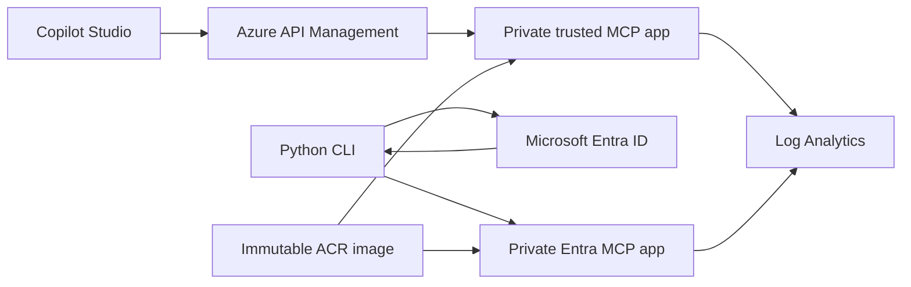

# Microsoft Copilot Studio MCP demo

The Microsoft Copilot Studio MCP demo proves two authentication patterns for stateless Model Context Protocol services hosted in Azure Container Apps. Both deployments run the same immutable service image, expose Streamable HTTP at `/mcp`, and use only fictitious customer data.

## Current Capabilities

- Copilot Studio can discover and invoke the customer list and lookup tools through Azure API Management.
- A native command-line client authenticates disposable demonstration users through Microsoft Entra device-code flow.
- The Entra-mode MCP service validates bearer-token signature, issuer, client-ID audience, lifetime, delegated scope, tenant, and immutable user object identifier.
- James sees two assigned customer records, Jane sees a different two records, and Bill sees none.
- The trusted-mode MCP service performs no native token validation and returns the complete fictitious catalog because its authentication boundary is external.
- Health probes, structured completion logs, and caller-provided correlation identifiers support operational verification without logging credentials or tool payloads.

## Architecture

The Standard v2 APIM gateway is public and reaches the trusted Container App through outbound VNet integration and private DNS. Its current route requires an API-scoped subscription key. The Entra Container App has no public APIM route in the current product state and is exercised only from an authorized private client path.

Both Container Apps run in one internal Azure Container Apps environment with public network access disabled. Their default-domain names do not resolve through public DNS. A shared user-assigned identity has `AcrPull` access to the registry, whose administrator credentials remain disabled.

## Workflows

The Copilot Studio workflow connects the test agent to the APIM MCP endpoint, supplies the API-scoped subscription key through a managed connection, discovers both tools, and invokes them in Preview. The temporary agent tool connection was removed after compatibility validation.

The native OAuth workflow starts the Python CLI for James, Jane, or Bill, completes interactive device-code authentication and consent, verifies that the token's `oid` matches the selected profile, and calls the private Entra MCP endpoint. Tokens and the MSAL cache remain in memory.

Infrastructure deployment proceeds in three ordered layers: Foundation, immutable container publication, and Application. Foundation owns networking, monitoring, APIM, the registry, Entra registrations, disposable users, and the sensitive local `.env`. Application deploys both private Container Apps from the exact digest recorded by the container layer.

## Security And Data Handling

The customer catalog contains only obviously fictitious names, reserved telephone numbers, and `example.com` email addresses. Entra authorization uses only verified immutable object identifiers; mutable display names and user principal names are not authorization subjects. Inaccessible and nonexistent customer lookups are indistinguishable.

Generated initial passwords are limited to first interactive sign-in. They remain in gitignored local Terraform state and the mode-`0600` root `.env`; the CLI does not read them. Access tokens, subscription keys, passwords, authorization headers, customer payloads, and response bodies are excluded from application logs.

## Validated State

Copilot Studio Preview discovered and invoked both MCP tools through APIM. The deployed Entra access matrix passed independent live device-code runs for James, Jane, and Bill. The trusted app returned all four fictitious records without an authorization header from a temporary private test path. Both apps run the same immutable image digest, health probes pass, public backend DNS resolution fails, and tagged client requests correlate with sanitized Container App telemetry.

See [MCP](msft-mcmc-mcp/MCP.md) for service and CLI behavior, [Deployment](msft-mcmc-deployment/Deployment.md) for infrastructure lifecycle procedures, [Vision](Vision.md) for the long-term architecture, and the active tickets for planned changes.