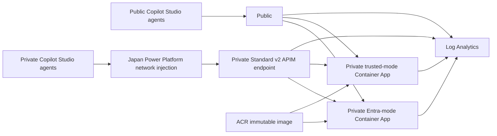

# Copilot Studio MCP Demonstration

This is a cross-solution deployment guide. It is a human-operated playbook; no AI agent is required. Change records remain in [_tickets/](_tickets/).

# Product and Components

The demonstration connects Microsoft Copilot Studio to Model Context Protocol (MCP) customer tools hosted in Azure Container Apps. All customer data is fictitious.

Two authentication patterns run from the same immutable container image:

| Route | Authentication boundary | Result |
| --- | --- | --- |
| `/native/mcp` | APIM forwards the bearer token. The Entra-mode service verifies it and filters customers by immutable user object ID. | James sees two customers, Jane sees two different customers, and Bill sees none. |
| `/gateway/mcp` | APIM verifies the bearer token, delegated scope, and `mcmc-customer-admins` group membership, then removes the token. | Members receive all four fictitious customers from the trusted-mode service. Bill is denied. |

Both routes exist on a public APIM instance and a private APIM instance. Private APIM requires a network path through its private endpoint; a public internet client cannot invoke it.



## Repository Responsibilities

| Component | Location | Responsibility |
| --- | --- | --- |
| Shared Azure configuration | [root.hcl](msft-mcmc-deployment/msft-mcmc-deployment-infra/terraform/root.hcl) | Subscription/tenant context, region, deterministic name suffix, tags |
| Foundation | [01-foundation/](msft-mcmc-deployment/msft-mcmc-deployment-infra/terraform/01-foundation/) | Resource group, ACR, networking, DNS, Container Apps environment, both APIM instances, diagnostics, Power Platform network policy, Entra registrations, demo users/group, credentials |
| Container publication | [buildandpush.sh](msft-mcmc-deployment/msft-mcmc-deployment-infra/terraform/02-container/buildandpush.sh) | Remote ACR build, versioned tag, immutable digest handoff |
| Application | [03-application/](msft-mcmc-deployment/msft-mcmc-deployment-infra/terraform/03-application/) | Two Container Apps, shared image-pull identity, `AcrPull`, APIM routes/operations/policies |
| MCP service | [msft-mcmc-mcp-service/](msft-mcmc-mcp/msft-mcmc-mcp-service/) | Python 3.12 ASGI runtime, official MCP Python SDK v2, customer tools, token verification, tests |
| Copilot Studio | [Power Platform setup](#power-platform-setup) | Manual environment, agent, connection, callback, publication, and verification workflow |

## Network and Identity Design

The following are repository configuration defaults, not values from a particular customer's subscription. Review region availability, network overlap, and naming with the deployment owner before applying. Subscription-suffixed names and endpoint addresses must be read from your own deployment outputs.

| Resource | Configuration |
| --- | --- |
| Application region | Japan East (`japaneast`) |
| Power Platform geography | Japan; paired injection VNets in Japan East and Japan West |
| Deployment resource group | `mcmc-deployment-rg` |
| Platform-managed Container Apps group | `mcmc-container-apps-managed-rg` |
| Deployment VNet | `10.58.0.0/24` |
| Public APIM integration subnet | `10.58.0.0/27`, delegated to `Microsoft.Web/serverFarms` |
| Private APIM integration subnet | `10.58.0.32/27`, delegated to `Microsoft.Web/serverFarms` |
| Internal Container Apps subnet | `10.58.0.64/27` |
| APIM private-endpoint subnet | `10.58.0.96/27` |
| Japan East injection VNet/subnet | `10.59.0.0/24` / `10.59.0.0/27` |
| Japan West injection VNet/subnet | `10.60.0.0/24` / `10.60.0.0/27` |
| Injection subnet delegation | `Microsoft.PowerPlatform/enterprisePolicies` |
| Enterprise policy | `mcmc-private-connectivity`, location `japan` |
| Private APIM DNS | `privatelink.azure-api.net`, linked to all three VNets |
| VNet peering | Bidirectional; regional to Japan East, global to Japan West |

Both APIM instances use `StandardV2_1` with separate outbound integration subnets. Public APIM has public access enabled and no private endpoint. Private APIM has an approved `Gateway` private endpoint and public access disabled. Azure allocates private IP addresses; they are not guaranteed to remain the same across redeployments.

The Container Apps environment is internal with public access disabled. Both apps permit ingress only from the two APIM integration subnets. ACR uses Basic SKU, no administrator credentials, and public access for authenticated image builds. Apps pull through managed identity.

Foundation creates the API registration, an auxiliary public-client registration, four confidential connector registrations and secrets, James/Jane/Bill demo users, and the customer-administrator group. James, Jane, and the configured deployment administrator are group members; Bill is not. Each initial demo password must be replaced during first browser sign-in. Power Platform generates each new connector callback; an administrator registers it manually on the matching Entra application in [Add the MCP server and register its OAuth callback](#add-the-mcp-server-and-register-its-oauth-callback). Terraform ignores subsequent connector `web` changes so it does not remove them.

Sensitive artifacts are the root `.env`, Terraform state/backups, and saved plans/plan JSON. They must not be committed, shared, or copied into containers.

# Prepare the Operator Workstation

## How to Use the Playbook

Run each fenced command separately, in order. Wait for completion and check the stated result before the next command. `text` fences are browser/portal actions, not terminal commands. Code fences containing a loop, function definition, or Python here-document are a single executable instruction; copy the entire fence.

All terminal steps use Bash in one terminal session. Do not run two Terraform processes against the same local state. If you open a new terminal, repeat [Set paths and protect generated files](#set-paths-and-protect-generated-files), [Check the tools](#check-the-tools), and [Authenticate and check prerequisites](#authenticate-and-check-prerequisites) to restore variables/functions/authentication context. An error, unexpected account, unexpected resource deletion/replacement, or missing prerequisite is a **stop condition**, not permission to continue.

## Use the Repository Development Container

The recommended workstation is the repository's VS Code development container. It provisions Azure CLI, Terraform/Terragrunt, Python 3.12, `uv`, and ancillary development tools. Docker is required on the workstation hosting the container, not for the remote ACR image build.

1. Open the repository in VS Code.

   - VS Code > File > Open Folder > select the mcsmcpsample repository folder.

2. Start its development container.

   - VS Code Command Palette > Dev Containers: Reopen in Container.

3. Wait for the container build and post-create command to complete.

   - Check the Dev Containers output. Stop if the build or post-create command failed.

4. Open a Bash terminal inside it.

   - VS Code > Terminal > New Terminal. Select Bash if prompted.

The development container and service build use the standard public npm, NuGet, and Python package registries.

## Set Paths and Protect Generated Files

1. Move to the repository root. For another checkout location, replace only the path in this command.

```bash
cd /workspaces/mcsmcpsample
```

2. Save its absolute location.

```bash
export REPO_ROOT="$(git rev-parse --show-toplevel)"
```

3. Set restrictive permissions for newly generated files.

```bash
umask 077
```

Make a failed command in a pipeline visible as a failed pipeline.

```bash
set -o pipefail
```

4. Create a unique temporary directory for plans and verification responses.

```bash
export RUN_DIR="$(mktemp -d /tmp/mcmc-operator.XXXXXX)"
```

5. Confirm its permissions. Expected mode: `700`.

```bash
stat -c '%a %n' "$RUN_DIR"
```

6. Allow slow provider startup, as needed in this deployment environment.

```bash
export TF_PLUGIN_TIMEOUT=5m
```

7. Record the two layer paths.

```bash
export FOUNDATION_DIR="$REPO_ROOT/msft-mcmc-deployment/msft-mcmc-deployment-infra/terraform/01-foundation"
```

```bash
export APPLICATION_DIR="$REPO_ROOT/msft-mcmc-deployment/msft-mcmc-deployment-infra/terraform/03-application"
```

8. Define directory-safe command wrappers. Each runs in a subshell and leaves your terminal in the repository root.

```bash
foundation() { (cd "$FOUNDATION_DIR" && terragrunt run -- "$@"); }
```

```bash
application() { (cd "$APPLICATION_DIR" && terragrunt run -- "$@"); }
```

## Check the Tools

Run each check. Stop if any command is missing. Terraform configuration requires `>=1.10,<2.0`. Use the Terragrunt version supplied by the development container, supporting `terragrunt run --`. Python must be 3.12 for the service project. Git, `curl`, `jq`, and `getent` are also required.

```bash
az version
```

```bash
terraform version
```

```bash
terragrunt --version
```

```bash
python --version
```

```bash
uv --version
```

```bash
git --version
```

```bash
curl --version
```

```bash
jq --version
```

```bash
command -v getent
```

The development container normally synchronizes service dependencies. If that step has not completed, run:

```bash
uv sync --frozen --project "$REPO_ROOT/msft-mcmc-mcp/msft-mcmc-mcp-service"
```

Expected: dependencies resolve successfully from the approved proxy. Stop on failure.

# Solution Deployment

## Authenticate and Check Prerequisites

### Required Access

The operator needs Azure permission to create/delete the listed resources and assign roles (Owner on the approved deployment subscription is sufficient), and Entra permission to manage app registrations, service principals, demo users, and groups. Have the tenant administrator approve the required roles; do not assume Azure Owner grants Entra permissions.

Power Platform additionally requires environment provisioning/network-policy association permissions, appropriate Dataverse security roles, sufficient Dataverse capacity, and suitable Copilot Studio/Managed Environment licensing. Azure Owner alone is insufficient. Publishing is not part of the trial workflow.

1. Obtain approval for the cloud resources, ongoing APIM charges, disposable identities, and Power Platform capacity before starting.

   - Ask the Azure and Power Platform administrators to confirm the required access, budget, licenses, and Dataverse capacity for this demo.

2. Configure the repository for your tenant before any plan or apply.

Export the tenant-specific values required by [Foundation terragrunt.hcl](msft-mcmc-deployment/msft-mcmc-deployment-infra/terraform/01-foundation/terragrunt.hcl):

```bash
export MCMC_ENTRA_VERIFIED_DOMAIN="<verified-domain>"
export MCMC_ENTRA_CUSTOMER_ADMIN_USER_PRINCIPAL_NAME="<approved-administrator-upn>"
export MCMC_API_MANAGEMENT_PUBLISHER_EMAIL="<approved-publisher-email>"
```

| Input | Consumer-provided value / lookup |
| --- | --- |
| `entra_verified_domain` | Your tenant's verified domain from Entra > Identity > Custom domain names. |
| `entra_customer_admin_user_principal_name` | An existing approved administrator's UPN from Entra > Users. This account is added to the gateway authorization group. |
| `api_management_publisher_email` | Your approved APIM publisher contact email. |
| `api_management_publisher_name` | Your approved publisher display name. |
| `entra_customer_admin_group_name` | Approved gateway authorization group name; the repository default may be retained if it does not conflict. |

Review region/tags in [root.hcl](msft-mcmc-deployment/msft-mcmc-deployment-infra/terraform/root.hcl), Foundation resource/network inputs, and Application inputs with the deployment owner. Keep private-network geography consistent. Merely logging into a different subscription does not supply the required domain, administrator, or publisher environment values.

3. Record the configured resource names and Azure region for commands used before outputs exist. Copy these from the reviewed Terragrunt inputs, not from another deployment.

```bash
read -r -p 'Configured deployment resource group name: ' RESOURCE_GROUP
read -r -p 'Configured Container Apps managed resource group name: ' MANAGED_RESOURCE_GROUP
read -r -p 'Configured Container Apps environment name: ' CONTAINER_APPS_ENVIRONMENT
read -r -p 'Configured Azure application region code: ' AZURE_REGION
export RESOURCE_GROUP MANAGED_RESOURCE_GROUP CONTAINER_APPS_ENVIRONMENT AZURE_REGION
```

### Use a Dedicated Azure CLI Context

A dedicated context separates this deployment's authentication cache from other work. It is not Terraform state. Keep using it for all commands, including build and Power Platform diagnostics.

1. Select the context.

```bash
export AZURE_CONFIG_DIR="$HOME/.azure-mcmc"
```

2. Enter the tenant and subscription supplied by your administrators. Find the Tenant ID in Entra > Identity > Overview and Subscription ID in Azure portal > Subscriptions > approved subscription. These are your intended IDs, not values inferred from a potentially unrelated cached login.

```bash
read -r -p 'Approved Tenant ID: ' EXPECTED_TENANT_ID
read -r -p 'Approved Subscription ID: ' EXPECTED_SUBSCRIPTION_ID
export EXPECTED_TENANT_ID EXPECTED_SUBSCRIPTION_ID
```

Authenticate. Complete the displayed browser flow as the approved deployment administrator.

```bash
az login --tenant "$EXPECTED_TENANT_ID" --scope https://graph.microsoft.com/.default
```

If a browser cannot open from the terminal, use this alternative instead:

```bash
az login --tenant "$EXPECTED_TENANT_ID" --scope https://graph.microsoft.com/.default --use-device-code
```

3. Select the approved subscription.

```bash
az account set --subscription "$EXPECTED_SUBSCRIPTION_ID"
```

4. Check the account against the approved values entered above.

```bash
az account show --query '{subscription:id,tenant:tenantId,user:user.name}' --output json
```

5. Export provider context.

```bash
export ARM_SUBSCRIPTION_ID="$(az account show --query id --output tsv)"
```

```bash
export ARM_TENANT_ID="$(az account show --query tenantId --output tsv)"
```

6. Verify the subscription/tenant with an executable guard. Expected: `Account guard passed`.

```bash
if [[ -n "$EXPECTED_SUBSCRIPTION_ID" && -n "$EXPECTED_TENANT_ID" && "$ARM_SUBSCRIPTION_ID" == "$EXPECTED_SUBSCRIPTION_ID" && "$ARM_TENANT_ID" == "$EXPECTED_TENANT_ID" ]]; then printf 'Account guard passed\n'; else printf 'STOP: unexpected account\n' >&2; fi
```

7. Verify the exact Graph resource used by Terraform. Expected: the administrator's ID/display name, not `401`.

```bash
az rest --method get --resource https://graph.microsoft.com --url 'https://graph.microsoft.com/v1.0/me?$select=id,displayName'
```

8. Verify Azure management access. Expected: subscription details, not an authentication error.

```bash
az rest --method get --url "https://management.azure.com/subscriptions/$ARM_SUBSCRIPTION_ID?api-version=2022-12-01" --query '{id:subscriptionId,name:displayName,state:state}'
```

### Check Azure Providers and Regional Support

Terraform does not auto-register resource providers.

1. Check the required registrations.

```bash
for namespace in Microsoft.App Microsoft.ContainerRegistry Microsoft.OperationalInsights Microsoft.ApiManagement Microsoft.Network Microsoft.ManagedIdentity Microsoft.Insights Microsoft.PowerPlatform; do az provider show --namespace "$namespace" --query '{namespace:namespace,state:registrationState}' --output table || break; done
```

Expected: every state is `Registered`. For an unregistered namespace, register it using its exact name from the output; the following prompts rather than guessing a name:

```bash
read -r -p 'Unregistered provider namespace from the table: ' PROVIDER_NAMESPACE
```

```bash
az provider register --namespace "$PROVIDER_NAMESPACE" --wait
```

2. Confirm the configured application region appears in APIM service locations.

```bash
az provider show --namespace Microsoft.ApiManagement --query "resourceTypes[?resourceType=='service'].locations" --output json
```

3. Confirm Consumption availability in the configured application region.

```bash
az rest --method get --url "https://management.azure.com/subscriptions/$ARM_SUBSCRIPTION_ID/providers/Microsoft.App/locations/$AZURE_REGION/availableManagedEnvironmentsWorkloadProfileTypes?api-version=2025-01-01" --query 'value[].name'
```

Expected: includes `Consumption`. Provider listings do not guarantee allocation capacity. [APIM v2 region availability](https://learn.microsoft.com/azure/api-management/api-management-region-availability) must also list Standard v2 as available in the configured region. Stop if unavailable; do not change region ad hoc.

## Azure Deployment

### Pre-Flight

1. Confirm the application region in the file matches the approved `AZURE_REGION`.

```bash
grep 'location ' "$REPO_ROOT/msft-mcmc-deployment/msft-mcmc-deployment-infra/terraform/root.hcl"
```

2. Inspect tracked and untracked changes. Preserve unrelated operator work.

```bash
git -C "$REPO_ROOT" status --short
```

3. Check whether the deployment group exists.

```bash
az group exists --name "$RESOURCE_GROUP"
```

4. Check whether the platform-managed group exists.

```bash
az group exists --name "$MANAGED_RESOURCE_GROUP"
```

5. Inspect local state and image handoff file names without printing secrets.

```bash
find "$REPO_ROOT/.terraform-state" "$REPO_ROOT/msft-mcmc-deployment/msft-mcmc-deployment-infra/terraform/02-container" -maxdepth 1 -type f -print
```

If the state directory is absent on a fresh checkout, `find` reports that absence; this alone is not a deployment failure.

6. If Foundation state exists, count its managed instances.

```bash
if [[ -f "$REPO_ROOT/.terraform-state/foundation.terraform.tfstate" ]]; then jq '[.resources[] | select(.mode=="managed") | .instances[]] | length' "$REPO_ROOT/.terraform-state/foundation.terraform.tfstate"; else printf 'No Foundation state file\n'; fi
```

7. If Application state exists, count its managed instances.

```bash
if [[ -f "$REPO_ROOT/.terraform-state/application.terraform.tfstate" ]]; then jq '[.resources[] | select(.mode=="managed") | .instances[]] | length' "$REPO_ROOT/.terraform-state/application.terraform.tfstate"; else printf 'No Application state file\n'; fi
```

**Decision gate:** a clean deployment has absent resource groups and absent/empty managed state. Existing resources with matching state can be resumed after plan review. Existing resources without their state require maintainer-led recovery/import. Do not delete state to make a plan look clean. Old image manifests must not be reused with a recreated registry. For a clean teardown/redeploy, follow [Teardown and region migration](#teardown-and-region-migration) first. Smoke-test state is unrelated and must be preserved.

### Deploy Foundation

First-time creation needs two passes: Azure refuses creation of private APIM with public access already disabled. Bootstrap creates it and its private endpoint; lockdown then disables public access. Do not deploy private APIs/connectors before lockdown. For an already deployed Foundation, skip bootstrap and use the normal plan in 6.2 to avoid reopening private APIM.

#### Bootstrap a New Foundation

1. Generate a saved bootstrap plan.

```bash
foundation plan -var='private_api_management_public_network_access_enabled=true' -out="$RUN_DIR/foundation-bootstrap.tfplan"
```

2. Review that exact saved plan. Review locally: the display can contain sensitive values.

```bash
foundation show -no-color "$RUN_DIR/foundation-bootstrap.tfplan"
```

Expected for a fresh installation: additions for the configured Foundation resources, no changes/deletions. Check the configured application region, paired injection VNets, policy geography, identities, and resource names. Stop on unexpected replacement/deletion or mismatched inputs. Review the final plan summary; do not assume a failed plan produced a usable file or expect a fixed resource count across configuration changes.

3. Apply only the reviewed plan.

```bash
foundation apply "$RUN_DIR/foundation-bootstrap.tfplan"
```

Expected: `Apply complete!`. This can take several minutes. On error, stop and contact the deployment owner; do not proceed to build or Application.

#### Disable Private APIM Public Access

1. Generate the normal Foundation plan.

```bash
foundation plan -out="$RUN_DIR/foundation.tfplan"
```

2. Review it.

```bash
foundation show -no-color "$RUN_DIR/foundation.tfplan"
```

Expected immediately after bootstrap: only private APIM changes from public access enabled to disabled. An already converged deployment has no changes. Stop on unrelated changes.

3. Apply it.

```bash
foundation apply "$RUN_DIR/foundation.tfplan"
```

4. Verify private APIM. Expected: `Succeeded`, `Disabled`, approved private endpoint.

```bash
export PRIVATE_APIM_NAME="$(foundation output -raw private_api_management_name)"
az apim show --resource-group "$RESOURCE_GROUP" --name "$PRIVATE_APIM_NAME" --query '{state:provisioningState,public:publicNetworkAccess,connections:privateEndpointConnections[].privateLinkServiceConnectionState.status}' --output json
```

5. Verify the environment. Expected: the configured application region, `Succeeded`, `Disabled`, nonempty private domain/IP.

```bash
az containerapp env show --resource-group "$RESOURCE_GROUP" --name "$CONTAINER_APPS_ENVIRONMENT" --query '{location:location,state:properties.provisioningState,public:properties.publicNetworkAccess,domain:properties.defaultDomain,ip:properties.staticIp}' --output json
```

6. Verify credentials permissions without printing contents. Expected mode: `600`.

```bash
stat -c '%a %n' "$REPO_ROOT/.env"
```

### Build and Push the Image

1. Run the existing build script from the repository root.

```bash
(cd "$REPO_ROOT" && msft-mcmc-deployment/msft-mcmc-deployment-infra/terraform/02-container/buildandpush.sh)
```

This uses remote ACR Build for `linux/amd64`; a local Docker daemon is not needed. Expected: successful build/push and an `Image: ...@sha256:...` line. The script updates the tracked [version](version) before building; even a failed build consumes a build number. Never decrement it to retry.

2. Set the manifest path.

```bash
export IMAGE_MANIFEST="$REPO_ROOT/msft-mcmc-deployment/msft-mcmc-deployment-infra/terraform/02-container/image.json"
```

3. Review the nonsecret handoff.

```bash
jq '{registry,repository,tag,digest}' "$IMAGE_MANIFEST"
```

4. Read the registry name from Foundation.

```bash
export REGISTRY_NAME="$(foundation output -raw container_registry_name)"
```

5. Verify the registry's digest equals the manifest. Expected: `Digest verified`.

```bash
if [[ "$(az acr repository show --name "$REGISTRY_NAME" --image "$(jq -r '.repository + ":" + .tag' "$IMAGE_MANIFEST")" --query digest --output tsv)" == "$(jq -r '.digest' "$IMAGE_MANIFEST")" ]]; then printf 'Digest verified\n'; else printf 'STOP: image digest mismatch or registry query failed\n' >&2; fi
```

Stop on failed build, missing manifest, or digest mismatch. Application uses the manifest digest, not a floating tag.

### Deploy Application

1. Generate the saved plan.

```bash
application plan -out="$RUN_DIR/application.tfplan"
```

2. Review it.

```bash
application show -no-color "$RUN_DIR/application.tfplan"
```

Expected for a fresh deployment: additions for the configured Application resources, no changes/deletions. Both apps must use the exact manifest digest and existing Foundation environment. Stop on unexpected resources or image changes; do not rely on a fixed resource count.

3. Export its protected JSON for the policy validator.

```bash
application show -json "$RUN_DIR/application.tfplan" > "$RUN_DIR/application.json"
```

4. Validate rendered APIM policies. Expected: `APIM rendered policy validation passed`.

```bash
python "$REPO_ROOT/msft-mcmc-deployment/msft-mcmc-deployment-infra/tests/validate_apim_plan.py" "$RUN_DIR/application.json"
```

5. Apply the reviewed plan.

```bash
application apply "$RUN_DIR/application.tfplan"
```

Expected: `Apply complete!`. On error, retain state, stop, and contact the deployment owner.

### Verify

#### Convergence and Healthy Image Revisions

1. Validate Foundation syntax.

```bash
foundation validate
```

2. Validate Application syntax.

```bash
application validate
```

3. Generate the final Foundation plan.

```bash
foundation plan -detailed-exitcode -out="$RUN_DIR/foundation-verify.tfplan"
```

Expected exit code `0` and no changes. Exit `2` means changes needing review; exit `1` means an error. Stop for either; do not use the existence of a plan file as proof of success.

4. Export its protected JSON.

```bash
foundation show -json "$RUN_DIR/foundation-verify.tfplan" > "$RUN_DIR/foundation-verify.json"
```

5. Run the Foundation validator.

```bash
python "$REPO_ROOT/msft-mcmc-deployment/msft-mcmc-deployment-infra/tests/validate_foundation_plan.py" "$RUN_DIR/foundation-verify.json"
```

Expected: `Foundation private-ingress plan validation passed`. Use this validator after resources exist: on a first-create plan, computed IDs may be absent.

6. Check Application convergence.

```bash
application plan -detailed-exitcode -out="$RUN_DIR/application-verify.tfplan"
```

Expected exit `0` and no changes; stop on exit `1` or `2`.

7. Inspect both apps.

```bash
az containerapp list --resource-group "$RESOURCE_GROUP" --query '[].{name:name,state:properties.provisioningState,running:properties.runningStatus,latest:properties.latestRevisionName,ready:properties.latestReadyRevisionName,image:properties.template.containers[0].image}' --output json
```

Expected: both apps `Succeeded`/`Running`, latest revision equals ready revision, and both image strings match the verified manifest digest.

8. Inspect native revision health.

```bash
export NATIVE_APP_NAME="$(application output -raw native_container_app_name)"
az containerapp revision list --resource-group "$RESOURCE_GROUP" --name "$NATIVE_APP_NAME" --query '[].{name:name,active:properties.active,health:properties.healthState,replicas:properties.replicas}' --output json
```

9. Inspect gateway revision health.

```bash
export GATEWAY_APP_NAME="$(application output -raw gateway_container_app_name)"
az containerapp revision list --resource-group "$RESOURCE_GROUP" --name "$GATEWAY_APP_NAME" --query '[].{name:name,active:properties.active,health:properties.healthState,replicas:properties.replicas}' --output json
```

Expected: each active revision is `Healthy`, with one replica.

#### Public Endpoints and Internet Isolation

1. Load public/private APIM base URLs from outputs.

```bash
export PUBLIC_APIM_URL="$(foundation output -raw api_management_gateway_url)"
```

```bash
export PRIVATE_APIM_URL="$(foundation output -raw private_api_management_gateway_url)"
```

2. Request both public metadata documents.

```bash
for route in native gateway; do curl --fail-with-body --silent --show-error --max-time 60 "$PUBLIC_APIM_URL/.well-known/oauth-protected-resource/$route/mcp" | jq '{resource,authorization_servers,scopes_supported}'; done
```

Expected: two valid JSON documents with the corresponding route resource, your tenant's v2 issuer, and the scope returned by `foundation output -raw entra_mcp_delegated_scope`. `curl` must not report an HTTP error.

3. Check internet denial of private APIM.

```bash
curl --silent --show-error --max-time 60 --include "$PRIVATE_APIM_URL/.well-known/oauth-protected-resource/native/mcp"
```

Expected: explicit public-network-access-disabled denial. This can be an HTTP `404 Access Denied` with body `statusCode: 403` and a message requiring the private endpoint. An ordinary route-not-found `404` is not a pass.

4. Check missing bearer tokens.

```bash
for route in native gateway; do printf '\n%s missing bearer: ' "$route"; curl --silent --show-error --max-time 60 --output "$RUN_DIR/unauthorized.json" --write-out '%{http_code}\n' --header 'Content-Type: application/json' --header 'Accept: application/json, text/event-stream' --data '{"jsonrpc":"2.0","id":1,"method":"initialize","params":{"protocolVersion":"2025-03-26","capabilities":{},"clientInfo":{"name":"operator-check","version":"1.0"}}}' "$PUBLIC_APIM_URL/$route/mcp"; done
```

Expected: `401` for both routes.

5. Check malformed bearer tokens.

```bash
for route in native gateway; do printf '\n%s malformed bearer: ' "$route"; curl --silent --show-error --max-time 60 --output "$RUN_DIR/unauthorized.json" --write-out '%{http_code}\n' --header 'Authorization: Bearer invalid-token' --header 'Content-Type: application/json' --header 'Accept: application/json, text/event-stream' --data '{"jsonrpc":"2.0","id":1,"method":"initialize","params":{"protocolVersion":"2025-03-26","capabilities":{},"clientInfo":{"name":"operator-check","version":"1.0"}}}' "$PUBLIC_APIM_URL/$route/mcp"; done
```

Expected: `401` for both routes.

6. Read private backend names.

```bash
export NATIVE_FQDN="$(application output -raw native_container_app_fqdn)"
```

```bash
export GATEWAY_FQDN="$(application output -raw gateway_container_app_fqdn)"
```

7. Check DNS from this internet-connected workstation.

```bash
for host in "$NATIVE_FQDN" "$GATEWAY_FQDN"; do if getent ahostsv4 "$host"; then printf 'STOP: backend resolves here: %s\n' "$host"; else printf 'Backend not resolvable here: %s\n' "$host"; fi; done
```

Expected: both names do not resolve from an external workstation. If the workstation is already inside a linked VNet, this is not an external isolation test. A general workstation DNS outage is also not proof of isolation; the public requests above must have succeeded.

#### Private-Network Metadata Verification

Use the existing native Container App; no new VM or test infrastructure is necessary. This proves the deployed application VNet path, not the Power Platform connector path.

1. Record the expected endpoint IP.

```bash
foundation output -raw api_management_private_endpoint_ip_address
```

2. Open an interactive shell in the native app. Keep its terminal open.

```bash
az containerapp exec --resource-group "$RESOURCE_GROUP" --name "$NATIVE_APP_NAME" --command sh
```

Expected: connection to the `mcp-service` container. If the terminal is not interactive, stop and use a normal VS Code Bash terminal.

3. **Inside the container shell**, resolve the private hostname.

```bash
read -r -p 'Private APIM hostname from your Foundation gateway URL (without https://): ' PRIVATE_APIM_HOST
export PRIVATE_APIM_HOST
python -c "import os, socket; print(socket.gethostbyname(os.environ['PRIVATE_APIM_HOST']))"
```

Expected: the same private IP recorded in step 1, not a public IP.

4. **Inside the container shell**, request both private metadata documents.

```bash
python - <<'PY'
import json
import os
import urllib.request
base_url = "https://" + os.environ["PRIVATE_APIM_HOST"]
for route in ("native", "gateway"):
    url = f"{base_url}/.well-known/oauth-protected-resource/{route}/mcp"
    with urllib.request.urlopen(url, timeout=60) as response:
        payload = json.load(response)
        assert response.status == 200
        assert payload["resource"] == f"{base_url}/{route}/mcp"
        print("PASS", route, response.status, payload["resource"])
PY
```

Expected: two `PASS` lines. Do not copy root credentials or bearer tokens into the container.

5. Leave the container shell.

```bash
exit
```

Expected: return to your workstation Bash prompt.

#### Human Sign-In and Customer-Tool Acceptance

Authenticated customer-tool acceptance is performed through the manually created Copilot Studio agents in [Pass the Public Gateway Preview gate](#pass-the-public-gateway-preview-gate) through [Final acceptance and operator handoff](#final-acceptance-and-operator-handoff). Infrastructure checks alone do not prove per-user authorization. Complete each test account's initial sign-in before using those agents.

1. Open the local credential file in VS Code. Do not print it into logs or share it.

   - VS Code Explorer > repository root > .env.
   - Read the selected user's UPN and INITIAL_PASSWORD locally.
   - Do not copy the whole file, and do not commit it.

2. Complete the selected user's initial password change in a private browser session.

   - Open https://myaccount.microsoft.com/ in an InPrivate/incognito window.
   - Sign in as the selected demo user using the local initial password.
   - Complete the required password change and any tenant-required security setup.
   - Keep the replacement password in an approved secure location.

Repeat that browser action for James, Jane, and Bill. The original password in `.env` is not updated after browser password change.

3. Continue to [Power Platform setup](#power-platform-setup) after the infrastructure gate below. Use the actual user principal names produced by your Foundation deployment. Verify list and allowed/denied lookups for each user through their own connection; record native filtering and gateway denial separately.

#### Acceptance Gate and Cleanup

| Check | Required result |
| --- | --- |
| Terraform | Both layers validate and have no-change plans |
| Image/revisions | Both healthy apps run the verified ACR digest |
| Public metadata | Both routes return correct metadata |
| Invalid/missing bearer | Both routes return `401` |
| Private isolation | Explicit internet denial, private DNS/IP correct, private metadata `200` |
| Customer authorization ([Power Platform setup](#power-platform-setup)) | James/Jane filtered natively and all four through gateway; Bill empty natively and denied by gateway |

This is the infrastructure acceptance gate. Customer authorization is completed in [Power Platform setup](#power-platform-setup), not a prerequisite to creating the agents. Dedicated expired/wrong-scope/wrong-audience token checks require separate security validation; do not report them as passed based on missing/malformed-token tests.

1. Remove the named temporary files after review. Do not delete active Terraform state.

```bash
rm -f -- "$RUN_DIR/foundation-bootstrap.tfplan" "$RUN_DIR/foundation.tfplan" "$RUN_DIR/foundation-verify.tfplan" "$RUN_DIR/foundation-verify.json" "$RUN_DIR/application.tfplan" "$RUN_DIR/application.json" "$RUN_DIR/application-verify.tfplan" "$RUN_DIR/unauthorized.json"
```

Retain the generated image manifest for future Application evaluation. Keep state/backups protected for future plan/destroy operations.

## Power Platform Setup

This is the **manual setup procedure**. Create the environment, agents, MCP connections, and callbacks through the supported portals. Azure deployment remains covered by [Pre-flight](#pre-flight) through [Verify](#verify).

**Starting state:** the Azure deployment in [Pre-flight](#pre-flight) through [Verify](#verify) is complete, including four connector Entra applications and a private-network enterprise policy. This procedure creates a dedicated Power Platform environment and four standard-harness agents manually. It does not require deleting an existing deployment.

**Documentation status:** this is the intended workflow, based on portal UI and linked Microsoft guidance, not an end-to-end certification. Test prompts describe expected results; the consumer must record actual acceptance for their deployment.

Follow [Check capacity, accounts, and retained Azure resources](#check-capacity-accounts-and-retained-azure-resources) through [Final acceptance and operator handoff](#final-acceptance-and-operator-handoff) in order. Complete Public Gateway first, then each remaining agent one at a time. If a required control is missing or a step reports an error, stop at that step and contact the responsible administrator; do not invent identifiers, create duplicates, or weaken security to proceed.

**Placeholder rule:** values written as `<VALUE_NAME>` are not literal text to paste into a portal. Gather their actual values in step 1 of [Check capacity, accounts, and retained Azure resources](#check-capacity-accounts-and-retained-azure-resources), replace the entire placeholder including angle brackets, and check for remaining `<` or `>` before saving. Product URLs such as `https://entra.microsoft.com/` are universal; deployment endpoints, identifiers, accounts, and scopes are not. Agent names below are suggested demo names, not resource identifiers.

### Check Capacity, Accounts, and Retained Azure Resources

1. Obtain the deployment values from the Azure deployment owner.

Keep a non-secret operator record using this table. The owner can supply the named Terraform outputs from the completed deployment; the operator does not need to rerun Terraform. Portal alternatives are listed where applicable.

| Placeholder / value | Where to obtain the actual value |
| --- | --- |
| `<TENANT_ID>` | Entra admin center > Identity > Overview > Tenant ID; Foundation output `entra_tenant_id`. Confirm this is also the tenant used in every admin portal. |
| `<SUBSCRIPTION_ID>` | Azure portal > Subscriptions > deployed subscription > Subscription ID. |
| `<RESOURCE_GROUP>` | Azure deployment resource group; Foundation output `resource_group_name`. |
| `<NETWORK_POLICY_NAME>` | Azure resource group > Microsoft.PowerPlatform/enterprisePolicies resource; Foundation output `power_platform_enterprise_policy_id` identifies it. |
| `<POWER_PLATFORM_REGION>` and `<MACRO_REGION_GEOGRAPHY>` | Deployment owner's supported Power Platform region and matching geography. Verify against the enterprise policy's location and its primary/failover delegated networks; Foundation output `power_platform_networks`. Do not substitute the Azure region name for the Power Platform region. |
| `<ENVIRONMENT_NAME>` | Administrator-approved dedicated environment name, for example MCMC Environment. |
| `<ENVIRONMENT_ID>` and `<DATAVERSE_URL>` | Record after creation: Power Platform admin center > Manage > Environments > intended environment > Details. |
| `<MAKER_ACCOUNT>` | Approved administrator/maker's user principal name. |
| James, Jane, Bill test accounts | Deployment owner's actual demo-user principal names; Foundation output `entra_demo_user_principal_names`. These names identify the three test roles, not fixed email addresses. |
| `<PUBLIC_GATEWAY_MCP_URL>` | Application output `api_management_gateway_mcp_url`. |
| `<PUBLIC_NATIVE_MCP_URL>` | Application output `api_management_native_mcp_url`. |
| `<PRIVATE_GATEWAY_MCP_URL>` | Application output `private_api_management_gateway_mcp_url`. |
| `<PRIVATE_NATIVE_MCP_URL>` | Application output `private_api_management_native_mcp_url`. |
| `<MCP_DELEGATED_SCOPE>` | Entra > App registrations > deployment's MCP API app > Expose an API: combine its Application ID URI and delegated scope name, normally `access_as_user`; Foundation output `entra_mcp_delegated_scope` is the complete value. Do not construct it from someone else's tenant domain. |
| Four connector client IDs | Secure deployment record or Foundation output `entra_mcp_connector_client_ids`, with keys `public_gateway`, `public_native`, `private_gateway`, `private_native`. Verify each against Entra > App registrations > Application (client) ID. |
| Four connector secret values | Approved secure credential store, or local `.env` populated for this deployment by its owner. Existing secret values cannot be recovered from Entra; ask the owner for a current value or an approved rotation. Never put secrets in this operator record. |
| Approved audience and billing arrangement | Tenant administrator: intended users/groups, Teams/Microsoft 365 entitlement, prepaid capacity or approved pay-as-you-go. |

The full MCP URLs must point to the deployed **APIM** host with `/gateway/mcp` or `/native/mcp` already included, not directly to a Container App. If using Azure portal instead of outputs, identify the correct public/private APIM in `<RESOURCE_GROUP>`, copy its gateway base URL from Overview, and append the route exactly once. Have the deployment owner confirm the resulting URLs.

2. Confirm licensing and capacity with the tenant administrator.

   - Open https://admin.powerplatform.microsoft.com/.
   - Check capacity for a Dataverse-backed Sandbox (at least 1 GB available database capacity).
   - Confirm the maker has applicable Copilot Studio access and the environment's users meet Managed Environment licensing requirements.
   - Before publishing, separately confirm Copilot Credits/capacity or approved pay-as-you-go billing.
   - A maker trial or user license alone is not proof that published usage is funded.

For the capacity check, open **Licensing > Copilot Studio > Summary**. Review **Prepaid capacity**, available credits, and warnings. Then open **Environments** and inspect the intended environment after creation. **Allocated capacity = No** does not mean there is no capacity when **Draw from tenant = Yes** and the tenant has available prepaid credits. Check the displayed refresh date. Do not create a paid billing plan merely because the portal recommends one.

3. Check the completed deployment in Azure.

   - Open https://portal.azure.com/ > Resource groups > `<RESOURCE_GROUP>`.
   - Confirm both APIM services, both Container Apps, and `<NETWORK_POLICY_NAME>` exist.
   - Confirm private APIM public network access remains Disabled.
   - Do not redeploy Azure or create duplicate Entra applications for this Power Platform rebuild.

4. Identify the four connector credentials locally.

   - In VS Code, open the repository root .env privately.
   - For each credential prefix in Create the Public Gateway agent, locate CLIENT_ID and CLIENT_SECRET.
   - Copy only the required value into the corresponding secure portal field.
   - Never paste the file, secrets, access tokens, or complete sign-in URLs into chat or screenshots.

5. Check secret validity before using the credentials.

   - Open https://entra.microsoft.com/ > App registrations > All applications.
   - Find each connector application by its Application (client) ID from .env.
   - Open Certificates & secrets and check expiration.
   - If a secret was exposed or expired, have the credential owner rotate it before use.
   - Enter the replacement secret VALUE, not the secret ID, in the MCP wizard.
   - Keep the secure credential record synchronized with the replacement.
   - Do not assume an exposed secret was rotated during teardown.

Manual secret changes must be coordinated with the Azure/Terraform owner; do not rerun Foundation casually to regenerate credentials.

### Create the Dataverse Environment Manually

1. Open environment creation.

   - Power Platform admin center > Manage > Environments > New.
   - Use the deployment administrator in the intended tenant.
   - Do not select the tenant Default or Microsoft 365 Copilot environment.

2. Enter the environment settings.

   - Type: Sandbox
   - Macro Region Geography: `<MACRO_REGION_GEOGRAPHY>` Name: `<ENVIRONMENT_NAME>` Expand Change default settings.
   - Environment group: leave blank
   - Make this a Managed Environment: Yes
   - Add a Dataverse data store: Yes
   - Pay-as-you-go with Azure: No if the administrator confirmed prepaid capacity; otherwise use only the approved billing arrangement.
   - Select Next.

The form may offer macro geography instead of a specific region. The service chooses a region based on capacity. Verify the resulting region against `<POWER_PLATFORM_REGION>` before linking the network policy; choosing a broad geography does not guarantee the required region.

3. Configure Dataverse and create the environment.

   - Language: English (United States)
   - Currency: USD ($)
   - Security group (required): Select > None for this administrator-approved demo
   - URL: keep the generated URL
   - Enable Dynamics 365 apps: No
   - Deploy sample apps and data: No
   - Review the settings, then select Save.

Disabling Dynamics 365 apps at creation cannot later be reversed for this environment. If your administrator requires a security group instead of None, select the approved group and include the maker and all intended demo users.

4. Wait for provisioning.

   - Refresh Manage > Environments until the new environment is Ready.
   - Open it and confirm the Dataverse environment URL is present.
   - Confirm Region = `<POWER_PLATFORM_REGION>`, Type = Sandbox, and the intended Managed setting.
   - Check History for successful provisioning.
   - If Region differs from the policy's supported region, stop and consult the deployment owner.
   - Do not create another environment because provisioning takes several minutes.

5. Record the new handles in an approved operator record.

   - Record the environment name, Environment ID, Dataverse URL, and region from its details.
   - Use these new values in all later portal selections and any future diagnostics.
   - The deleted Dataverse URL cannot be reused for at least 24 hours; use a new URL if necessary.

Managed Environment was selected in the creation form; do not enable it a second time as a routine step. If details show it is not Managed, stop and review the configuration/licensing with the administrator before policy association.

Reference: [Create environments](https://learn.microsoft.com/en-us/power-platform/admin/create-environment).

### Grant Maker Access and Prepare Demo Users

1. Give the maker appropriate Dataverse roles.

   - Open `<ENVIRONMENT_NAME>` > Settings > Users + permissions > Users.
   - Select the maker > Manage security roles.
   - Grant Basic User, Environment Maker, and System Customizer, or an administrator-approved System Administrator role.
   - If the maker already has System Administrator and Basic User, no extra roles are needed.
   - Save and verify that the maker can open the environment in Copilot Studio.

2. Request administrator help if the maker cannot administer the new environment.

   - Where available, open Membership > System Administrators > Add me using an authorized tenant administrator.
   - Otherwise ask an existing Dataverse administrator to grant access.
   - Wait for propagation and refresh; do not bypass permissions or create a duplicate environment.

3. Prepare James, Jane, and Bill for the intended testing mode.

   - Microsoft 365 admin center > Users > Active users > select each demo user.
   - Assign the licenses required for that user's intended Power Platform access.
   - For Teams testing, verify each user has a license containing the Microsoft Teams service, and that Microsoft Teams is enabled under Licenses and apps > Apps.
   - For temporary maker/Preview testing, verify Copilot Studio maker entitlement.
   - Complete each user's initial password change in a separate browser profile.
   - Check the environment security-group membership if one was selected.

4. For temporary maker tests only, add environment roles.

   - `<ENVIRONMENT_NAME>` > Settings > Users + permissions > Users.
   - Add/refresh each licensed demo user where required and confirm the account is enabled.
   - Grant Basic User and Environment Maker for approved maker testing.
   - Do not grant System Administrator to ordinary demo users.

Published end users do not need Editor sharing or Environment Maker merely to chat with an agent. Temporary maker access and published audience access are different permissions; remove temporary privileges when no longer needed.

5. Resolve missing Teams licenses before published testing.

   - Microsoft 365 admin center > Users > Active users > select the user > Licenses and apps.
   - Set the correct Usage location if requested.
   - Select an available, approved license that includes Microsoft Teams.
   - Expand Apps and verify Microsoft Teams is enabled, then Save changes.
   - Wait for provisioning, then open https://teams.microsoft.com/ in that user's own browser profile.
   - Confirm normal Teams chat works before testing the agent.

Teams Exploratory is a self-service offer, not an ordinary admin-assignable seat: an eligible user signs into Teams and accepts the trial if offered. Do not assume every user is eligible, or that its displayed seat count permits administrator assignment. Record the trial expiry; the current documentation describes a one-month trial. Prefer the administrator-approved licensing arrangement rather than depending on a trial for deployment.

Teams Premium and calling plans are add-ons, not base Teams user licenses. Rooms Pro, Shared Space, and Phone Resource Account are not substitutes for ordinary user access. A Copilot Studio User License permits authoring; it does not provide base Teams access.

6. If no suitable seat is free, have the administrator approve reassignment or procurement.

   - Billing > Licenses > select a product containing Microsoft Teams > review assigned users.
   - Identify an unused account whose owner approves removal; do not choose an active account.
   - Record the donor's license and enabled apps.
   - Users > Active users > donor > Licenses and apps > untick only the approved suite > Save changes.
   - Users > Active users > recipient > Licenses and apps > tick the freed suite.
   - Expand Apps > ensure Microsoft Teams is enabled > Save changes.
   - Wait for provisioning and test Teams in the recipient's separate browser profile.
   - Repeat for the other user if required.

Removing a suite can disrupt the donor's email, OneDrive, Teams, and other services. If a license is group-assigned, involve the administrator who manages that licensing group; do not remove group membership without checking its other access effects. Check actual tenant seat availability before making any assignment.

References: [Teams user licensing](https://learn.microsoft.com/en-us/microsoftteams/user-access), [Teams Exploratory](https://learn.microsoft.com/en-us/microsoftteams/teams-exploratory).

### Associate the Existing Private-Network Policy in the Portal

The public pilot can be tested before this association; **both private agents require it**. The completed Azure deployment supplies the policy and its delegated primary/failover networks. Do not create another policy or enable private APIM public access.

1. Verify the existing policy and read permission.

   - Azure portal > `<RESOURCE_GROUP>` > `<NETWORK_POLICY_NAME>`.
   - Confirm its Power Platform region and delegated networks match the deployment record.
   - If a different administrator will associate it, grant that administrator the approved read permission on this enterprise policy.

2. Link it to the new environment.

   - Power Platform admin center > Security > Data and privacy > Azure Virtual Network policies.
   - Select `<ENVIRONMENT_NAME>` and verify its ID is `<ENVIRONMENT_ID>`.
   - Select `<NETWORK_POLICY_NAME>` from subscription `<SUBSCRIPTION_ID>`, then Save.

3. Verify association completion.

   - Manage > Environments > `<ENVIRONMENT_NAME>` > History.
   - Require the network-policy operation to show Succeeded.
   - Return to Azure Virtual Network policies and confirm the intended environment/policy association.
   - Allow up to 30 minutes for connector runtime initialization.
   - If the policy is missing or association fails, stop and request administrator assistance.

Reference: Microsoft's [manual VNet setup](https://learn.microsoft.com/en-us/power-platform/admin/vnet-support-setup-configure?tabs=manual). Private connectivity is accepted only after actual private tool calls pass [Create the other agents and verify individual user access](#create-the-other-agents-and-verify-individual-user-access), not merely because a policy is linked.

### Create the Public Gateway Agent

Use this mapping throughout creation; each agent gets exactly one MCP server connection and its own matching connector application.

| Agent | Full server URL for the MCP wizard | Local credential prefix |
| --- | --- | --- |
| MCMC Public Gateway | `<PUBLIC_GATEWAY_MCP_URL>` | `MCMC_PUBLIC_GATEWAY_CONNECTOR` |
| MCMC Public Native | `<PUBLIC_NATIVE_MCP_URL>` | `MCMC_PUBLIC_NATIVE_CONNECTOR` |
| MCMC Private Gateway | `<PRIVATE_GATEWAY_MCP_URL>` | `MCMC_PRIVATE_GATEWAY_CONNECTOR` |
| MCMC Private Native | `<PRIVATE_NATIVE_MCP_URL>` | `MCMC_PRIVATE_NATIVE_CONNECTOR` |

1. Start a blank agent in the new environment.

   - Open https://copilotstudio.microsoft.com/.
   - Select `<ENVIRONMENT_NAME>` using the environment selector.
   - Before creation, check the browser URL contains /environments/`<ENVIRONMENT_ID>`/.
   - If it contains /environments/Default- or another environment ID, stop and switch environments.
   - On the Create/home screen, select Other ways to build.
   - Choose the standard agent option, not the Microsoft 365 Copilot extension or an agent flow.
   - Do not choose the Agent (GitHub Copilot) or Workflow (GitHub Copilot) tiles for this playbook.
   - Name it MCMC Public Gateway.
   - Skip the conversational setup if offered and configure the agent directly.
   - Do not import a solution or reuse an agent from another environment.
   - Create and wait for the agent to open.
   - Check the resulting URL still contains /environments/`<ENVIRONMENT_ID>`/bots/.
   - Record the new agent ID from the URL; do not configure an agent in the wrong environment.

2. Configure orchestration.

   - Agent > Settings > Generative AI (or the orchestration setting).
   - Under Orchestration, select Yes for "Use generative AI orchestration for your agent's responses?"
   - Deep reasoning (preview): Off
   - Scroll down to Knowledge:
     - Allow ungrounded responses: Off
     - Use information from the Web: Off
   - Under File processing capabilities:
     - File uploads: Off
     - Code interpreter: Off
   - Under Search:
     - Tenant graph grounding with semantic search: Off
   - Select Save after changes.
   - Leave customer knowledge sources empty; the MCP server is the customer-data source.

These labels were observed under **Settings > Generative AI**, not on Overview. Leave **Let other agents connect to and use this one** at its default unless your administrator requires otherwise; it is separate from MCP server access. Turning ungrounded responses off also restricts conversation-only answers, not just general customer knowledge. Use the explicit tool prompts below for acceptance, rather than relying on small talk.

Reference: [Access standard-harness agents](https://learn.microsoft.com/en-us/microsoft-copilot-studio/agents-experience/switch-experiences). The standard harness still offers generative orchestration; the "rule-based" wording on the creation screen is not a reason to turn it off.

3. Paste the following into the agent's Instructions field.

Close Settings, open **Overview > Instructions > Edit**, paste the block below, and save.

```text
You are the MCMC customer demonstration agent.
Use the connected MCP tools as the only source of customer data.
Use list_accessible_customers to list, show, count, or summarize accessible customers.
Use get_accessible_customer for a specific customer number.
If the customer number is missing, ask the user for it.
Return only records and attributes returned by the tool. Never invent customer data,
permissions, identifiers, or successful tool results.
Do not use web search or general knowledge to answer customer-data questions.
If authentication or a connection is required, direct the user to the platform's
Sign in/connection card. Never ask for passwords, client secrets, or tokens in chat.
If a tool fails, access is denied, or no connection is available, explain that
customer data could not be retrieved. Do not substitute another user's connection.
For a null customer result, say the customer was not found or is not accessible.
```

4. Configure agent sign-in.

   - Settings > Security > Authentication > Authenticate with Microsoft.
   - Save the agent's settings and instructions.
   - This signs the user into the agent; it does not replace the MCP connector's OAuth connection.

### Add the MCP Server and Register Its OAuth Callback

1. Open the MCP wizard.

   - MCMC Public Gateway > Tools > Add a tool > New tool > Model Context Protocol.
   - Server name: MCMC Public Gateway MCP
   - Description: List and look up fictitious customers through the gateway authorization route.
   - Server URL: `<PUBLIC_GATEWAY_MCP_URL>` Authentication: OAuth 2.0
   - OAuth type: Manual

2. Enter the Public Gateway OAuth settings.

| Wizard field | Value |
| --- | --- |
| Client ID | `MCMC_PUBLIC_GATEWAY_CONNECTOR_CLIENT_ID` from the local secure credential record |
| Client secret | Matching current secret **value** |
| Authorization URL | `https://login.microsoftonline.com/<TENANT_ID>/oauth2/v2.0/authorize` |
| Token URL template | `https://login.microsoftonline.com/<TENANT_ID>/oauth2/v2.0/token` |
| Refresh URL | Same tenant-specific token URL |
| Scopes | `<MCP_DELEGATED_SCOPE> offline_access` (two values separated by one space) |
| Redirect URL | Generated when saved; do not enter a guessed value |

   - Enter the fields above, then select Create.
   - Copy the generated callback/redirect URL locally.
   - Keep the wizard open; do not attempt sign-in until the callback is registered.

If the wizard was closed before copying the callback: open **https://make.powerapps.com/ > select `<ENVIRONMENT_NAME>` > More > Discover all > Custom connectors** (or Custom connectors directly). Find this exact MCP connector, select **Edit > Security**, and copy **Redirect URL**. Do not create another connector to recover the URL. If it is missing, verify the environment and allow provisioning to finish. After callback registration, return to the agent and add/select the existing connector, creating the connection only then.

The observed Manual OAuth form had no PKCE control. Do not switch to Dynamic or Dynamic discovery to find one. Treat the secret as confidential even when selecting text in an editor; editor selections can be included in a chat attachment.

The authorization endpoint must be query-free. Do not append `?prompt=select_account`: the connector can construct an invalid query and return `AADSTS900144`. Use an isolated browser profile for account selection, not URL editing.

3. Locate the matching Entra application.

   - Open https://entra.microsoft.com/ in an administrator browser session.
   - App registrations > All applications > search for the client ID used in this wizard.
   - Open it and verify Application (client) ID matches Public Gateway exactly.
   - Do not register this callback on the MCP API app, auxiliary public-client app, or another connector variant.

4. Add the generated redirect URI.

   - Matching connector app > Authentication > Add a platform > Web, or edit the existing Web platform.
   - Add the exact callback URL generated by this new connector and Save.
   - Preserve existing redirect URIs; do not replace the list.
   - Leave implicit/hybrid access-token and ID-token options unchecked.
   - Refresh and confirm the new URI is saved.

5. Verify delegated API consent.

   - Matching connector app > API permissions.
   - Confirm delegated access_as_user permission for MCMC MCP API is present.
   - Use normal user consent during sign-in where tenant policy permits.
   - Do not grant tenant-wide admin consent as a routine deployment step.
   - If sign-in requires administrator approval, stop and refer the request to the tenant administrator for review under the organization's consent policy.
   - Do not add application permissions or use client-credentials authentication.

6. Complete the wizard and create the maker's initial connection.

   - Return to the MCP wizard > Next.
   - In Add tool, choose Create a new connection and Sign in.
   - For this first maker test, authorize as the intended maker/admin and verify that account.
   - Approve the delegated consent if permitted, select the connection, and add the tool.
   - Save the agent.

7. Verify tool discovery and runtime credentials.

   - Agent > Tools > open MCMC Public Gateway MCP.
   - Confirm list_accessible_customers and get_accessible_customer are discovered.
   - Enable the tool if disabled.
   - In the tool's authentication settings, use End user credentials for per-user testing.
   - Do not choose shared maker credentials for the user-isolation demonstration.
   - Save and refresh once if needed.

**Stop if tools remain empty.** A green connection alone is not a discovery or runtime pass. Do not add duplicate tools or rerun setup scripts to repair a manually created agent.

The MCP wizard takes the **full server URL**. If inspecting a generated custom connector instead, its backend service URL must be the **host root**, base path `/`, with operation path `/gateway/mcp` or `/native/mcp`. Including the route in both backend and operation duplicates it (for example `/gateway/mcp/gateway/mcp`) and prevents routing to the intended backend operation.

Reference: [Microsoft MCP onboarding wizard](https://learn.microsoft.com/en-us/microsoft-copilot-studio/mcp-add-existing-server-to-agent).

### Pass the Public Gateway Preview Gate

1. Start a new test conversation.

   - Open the agent's Test/Preview panel and start a new session.
   - Send: List the customers I can access.
   - Complete any displayed Sign in/connection prompt as the intended maker.
   - Inspect the activity trace for list_accessible_customers, not a web search or invented answer.
   - For the deployment administrator, expect all four fictitious customers.

2. Test a lookup.

   - Send: Get customer CUST-1001.
   - Require get_accessible_customer with customer_number set to CUST-1001.
   - Compare the response with the actual tool result.

3. Record the pilot result.

   - Record the new environment ID, agent ID, connector name/ID, tool names, connection account, and Preview result without secrets.
   - Stop if discovery, sign-in, or invocation fails.
   - Continue to Publish and test the Public Gateway pilot for this pilot before creating the remaining agents.

### Publish and Test the Public Gateway Pilot

Complete this pilot before multiplying agents. The procedure below enables both Teams and Microsoft 365 Copilot for an administrator-approved audience. Ordinary Teams users do not need maker/Editor permissions. Obtain explicit approval before choosing organization-wide availability or All users installation. If only Preview is approved, do not publish; record that channel acceptance is out of scope.

1. Review security and credentials before publishing.

   - Confirm publishing capacity/billing with the tenant administrator.
   - Confirm all exposed/expired secrets have been replaced.
   - Agent authentication: Authenticate with Microsoft.
   - MCP tool authentication: End user credentials.
   - Confirm the pilot's latest Preview tests passed.

2. Publish the saved agent.

   - Agent > Publish > confirm.
   - During initial deployment/testing, select Force newest version if the option is available.
   - Wait for a successful publication and record its timestamp.
   - Saved changes are not automatically the published version.

**Force newest version** moves ongoing chats on persistent channels to the newly published version and can disrupt them. Use it for this controlled demo, not automatically for a live audience. If the dialog says **This agent is currently blocked**, cancel and complete step 6 before retrying; publishing does not remove a block.

3. Add the Teams and Microsoft 365 Copilot channel.

   - Channels > Microsoft 365 and Microsoft Teams > Add channel, if not already added.
   - Select Make agent available in Microsoft 365 Copilot.
   - Select Add channel/Save.
   - Save any channel changes and republish if requested.

4. Submit the pilot for organization-wide availability.

   - Open the channel panel > Availability options > Show to everyone in my org.
   - Review the app information and select Submit for admin approval.
   - Record the new app ID/installation link to distinguish it from deleted agents with the same name.

For a restricted audience instead, use **Show to my teammates and shared users**, share the agent with the intended users as End users, and enable the **Built with Power Platform** listing if offered. Do not grant Editor merely to permit Teams chat. Organization-wide discovery is broader than sharing only with three demo users.

5. Approve and assign availability in both admin portals.

   - Teams administrator: https://admin.teams.microsoft.com/ > Teams apps > Manage apps > search MCMC Public Gateway.
   - Open the submitted current app and verify its ID against the new channel app information.
   - Select Publish/Approve and confirm.
   - Verify Published/Allowed status.
   - Under available Users and groups controls, permit the approved audience (everyone for this demo).

   - Microsoft 365/Copilot administrator: https://admin.microsoft.com/ > Agents > All agents (or Copilot > Agents; older layouts use Settings > Integrated apps).
   - Find the current MCMC Public Gateway by name and ID.
   - Approve it if requested; if its status is already Available, do not repeat approval.
   - Open Users > Available to and verify the approved audience.
   - Open Users > Installed for and inspect the existing deployment.
   - If it says "This agent needs to be installed", select Install at the top.
   - In "Install agent for selected users", verify the agent name.
   - Check Host products: Copilot and Teams for this dual-channel deployment.
   - Select All users only for an approved organization-wide audience; otherwise select Specific users/groups and add the approved test accounts/group.
   - Proceed to review, verify the agent/audience/host products, and confirm installation.
   - Wait for the success message, then revisit Users > Installed for to verify deployment.
   - If the approved audience is already installed, do not repeat installation.
   - Review the resulting availability in both portals.

The Microsoft 365 admin installation wizard pre-installs the agent for selected users across **both Copilot and Teams**; it is not a Copilot-only installation. Two installations are not mandatory. Inspect **Installed for** before taking further action; do not remove an existing Teams installation merely because another portal has not updated.

Availability and installation do not by themselves prove Teams or Microsoft 365 Copilot chat works. If a portal exposes different controls, stop and have its administrator verify approval, allowed state, audience assignment, and deployment instead of guessing a button.

6. Verify the agent is allowed and allow propagation.

   - In the admin portal where the app/agent is blocked, open the current entry.
   - Verify the app/agent ID against the channel information, not just the display name.
   - Have the authorized administrator select Unblock/Allow/Enable as offered.
   - Save and wait for the change to propagate, then retry the same current agent.
   - If the agent remains blocked, retain the conversation ID and UTC timestamp for diagnostics.

If the Publish dialog says **This agent is currently blocked** or Activity returns **AgentBlocked**, verify the agent's allowed state in the admin controls. Publishing or reinstalling does not remove a block.

If an old entry needs removal, identify it by ID before blocking or deleting anything. A matching name alone is insufficient.

7. Open/install the current app in Teams as the administrator.

   - Channel panel > See agent in Teams.
   - Copy/open this current agent's link in the intended user's browser profile.
   - Sign into Teams as the allowed administrator.
   - Alternatively, Teams > Apps > Built for your org > search MCMC Public Gateway.
   - Verify it is the new app, then select Add/Open to start its personal chat.
   - If the app cannot be found, verify catalog approval and assigned availability; do not repeatedly recreate the agent or connector.
   - Use the NEW installation link, not the deleted agent's link.

Admin portals, app catalogs, user installations, and Activity reporting can update at different times. After a successful change, record the time and refresh the destination portal after allowing propagation; changes can take tens of minutes to become visible. A stale view is not a reason to repeat creation, approval, or installation. Check the actual IDs and assigned audience. If the expected state remains absent or a portal reports an error, stop and escalate with the IDs, UTC timestamp, and screenshot rather than assuming success.

8. Test the administrator's real Teams conversation.

   - Send: List the customers I can access.
   - If shown, open the connection manager, create/authorize that user's own MCP connection, return to Teams, and select Retry.
   - Verify the consent screen shows the administrator, not a cached demo account.
   - Require a visible customer response in Teams, not merely an Activity entry.
   - Send: Get customer CUST-1003.
   - Send: Get customer CUST-9999.
   - Expect all four customers in the list, the single requested accessible customer, and a not-found/not-accessible response for the nonexistent number.
   - Agent sign-in and connector consent are separate; publication does not eliminate consent.

9. Test James, Jane, and Bill separately in Teams.

   - Open a separate browser profile for each user at https://teams.microsoft.com/.
   - Confirm each has functioning Teams access (Grant maker access and prepare demo users), then open the current approved agent.
   - If asked to connect, create/authorize that user's own connection and verify their identity.
   - Do not reuse the administrator's connection or copy a connection ID between users.
   - Send: List the customers I can access.
   - Send: Get customer CUST-1001.
   - Send: Get customer CUST-1003.
   - Compare tool results with the Create the other agents and verify individual user access matrix.
   - Check Copilot Studio Activity for the matching Teams conversation and actual tool execution.
   - Require the answer/card to appear in Teams as well as in Activity.
   - An Activity transcript alone does not prove outbound delivery.

For the default deployed demo policy, James and Jane must receive all four customers on Public Gateway; Bill must receive an explicit access failure (gateway `403`), not fabricated data. Bill must still be able to sign into Teams and chat: gateway authorization denial is distinct from missing Teams licensing.

10. Test Microsoft 365 Copilot separately.

   - Open https://m365.cloud.microsoft/chat in the intended user's browser profile.
   - Find MCMC Public Gateway under Agents; open it.
   - Send: List the customers I can access.
   - Complete any per-user connection prompt, checking the selected identity.
   - Run the two lookup prompts from step 9 and compare with the same gateway matrix.
   - Record this channel's result separately from Teams.
   - If the agent is absent, review its deployment/audience and applicable Microsoft 365 entitlement.

Teams success is not Microsoft 365 Copilot acceptance. Record the actual result for each surface; do not mark an untested channel as passed.

11. If a published update is not loaded, complete a conversation reset.

   - Send: start over
   - Confirm the restart when asked, then retry.
   - If a fresh session still has no replies, compare Teams web and desktop with Activity.
   - Do not weaken authentication or enable public access to private APIM.
   - If replies still do not appear, stop and contact the deployment owner with the conversation ID and UTC timestamp.

Reference: [Connect and configure Teams channels](https://learn.microsoft.com/en-us/microsoft-copilot-studio/publication-add-bot-to-microsoft-teams).

Reference: [Manage agents in Microsoft 365 admin center](https://learn.microsoft.com/en-us/microsoft-365/admin/manage/manage-copilot-agents-integrated-apps).

### Create the Other Agents and Verify Individual User Access

Only begin after the Public Gateway pilot passes the approved channel gate. Create and test **one agent at a time**, in this order: **Public Native**, **Private Gateway**, **Private Native**. The following steps are the intended deployment procedure and expected checks, not a claim of completed testing.

For each agent, execute the following sequence from beginning to end before starting the next.

1. Select the matching row and credentials.

| Order | Agent name | MCP server name | Full server URL | Credential prefix in local `.env` |
| --- | --- | --- | --- | --- |
| 1 | MCMC Public Native | MCMC Public Native MCP | `<PUBLIC_NATIVE_MCP_URL>` | `MCMC_PUBLIC_NATIVE_CONNECTOR` |
| 2 | MCMC Private Gateway | MCMC Private Gateway MCP | `<PRIVATE_GATEWAY_MCP_URL>` | `MCMC_PRIVATE_GATEWAY_CONNECTOR` |
| 3 | MCMC Private Native | MCMC Private Native MCP | `<PRIVATE_NATIVE_MCP_URL>` | `MCMC_PRIVATE_NATIVE_CONNECTOR` |

For either private row, first recheck [Associate the existing private-network policy in the portal](#associate-the-existing-private-network-policy-in-the-portal): `<ENVIRONMENT_ID>` must be associated with `<NETWORK_POLICY_NAME>`, History must show Succeeded, the environment must be Managed, and private APIM public network access must remain Disabled. Allow up to 30 minutes after association for runtime initialization.

2. Create and configure the standard-harness agent.

   - Copilot Studio > select `<ENVIRONMENT_NAME>`.
   - Verify /environments/`<ENVIRONMENT_ID>`/ in the browser URL.
   - Create > Other ways to build > standard agent.
   - Use the exact agent name from the current row and create it.
   - Verify /environments/`<ENVIRONMENT_ID>`/bots/ again after creation and record the agent ID.
   - Settings > Generative AI > apply every setting in Create the Public Gateway agent step 2 > Save.
   - Overview > Instructions > Edit > paste the shared instructions from Create the Public Gateway agent > Save.
   - Settings > Security > Authentication > Authenticate with Microsoft > Save.

3. Create its own MCP server through the Manual OAuth wizard.

   - Tools > Add a tool > New tool > Model Context Protocol.
   - Use the server name and full URL from the current row.
   - Description for Native: List and look up fictitious customers with per-customer authorization.
   - Description for Gateway: List and look up fictitious customers through the gateway authorization route.
   - Select OAuth 2.0 > Manual.
   - Client ID: the current row's credential prefix followed by _CLIENT_ID.
   - Client secret: the matching current _CLIENT_SECRET value, entered privately.
   - Use the same tenant Authorization URL, Token URL template, Refresh URL, and Scopes as Add the MCP server and register its OAuth callback.
   - Select Create/save and copy the generated Redirect URL.
   - Do not sign in yet.

4. Register the callback on this variant's matching Entra application.

   - Entra > App registrations > All applications > search the Client ID entered in step 3.
   - Open the app and verify its Application (client) ID.
   - Authentication > existing Web platform > add the exact new Redirect URL > Save.
   - If no Web platform exists, Add a platform > Web > enter the Redirect URL > Save.
   - Preserve other redirect URIs; leave implicit access-token and ID-token issuance unchecked.
   - Refresh to verify the callback was saved.
   - API permissions > confirm delegated MCMC MCP API access_as_user.
   - Use normal user consent where allowed; do not grant tenant-wide admin consent as a routine step.
   - If administrator approval is requested, stop and refer it to the tenant administrator.

Do not register it on the Public Gateway, MCP API, auxiliary public-client app, or another variant's application. Do not copy connection IDs or redirect URLs from the pilot.

5. Connect as administrator and verify the discovered tools.

   - Return to the MCP wizard > Next > Create a new connection > Sign in.
   - Confirm the administrator account on the consent screen, then complete consent.
   - Select the connected connection > Add to agent/Add and configure.
   - Open the MCP tool details.
   - Require both list_accessible_customers and get_accessible_customer to be listed.
   - Keep the server/tools enabled.
   - Credentials to use > End user credentials > Save.

6. Pass the administrator Preview gate.

   - Test pane > start a fresh conversation.
   - Send: List the customers I can access.
   - Send: Get customer CUST-1003.
   - Send: Get customer CUST-9999.
   - Inspect the actual tool calls and returned records.
   - For Public Native or Private Native, the administrator's list should be empty and lookups should return not found/inaccessible: Admin has no native customer grants.
   - For Private Gateway, the deployment administrator should receive all four customers and the accessible lookup; CUST-9999 should return not found/inaccessible.
   - Record the environment ID, agent ID, connector/app details, account, and result without secrets.
   - Stop if discovery, sign-in, or invocation fails; do not create a duplicate agent to bypass it.

With the default deployed policy, an empty native list and not-found administrator lookups are expected authorization results, not connection failures. Native policy grants James `CUST-1001`/`CUST-1002`, Jane `CUST-1003`/`CUST-1004`, and Bill no customers; deployment administrator privileges and gateway group membership do not confer native customer access. Confirm the policy with the deployment owner if it was customized. Administrator results do not replace the three-user tests below.

7. Publish, approve, and install this agent.

Repeat **[Publish and test the Public Gateway pilot](#publish-and-test-the-public-gateway-pilot) steps 1-8** using this agent's name and its newly recorded IDs in both admin portals. Use that row's expected administrator results from step 6 above, not Public Gateway's four-customer expectation. Enable the same approved Teams and Microsoft 365 Copilot surfaces. Check that this new entry is Allowed/unblocked and assigned to the intended audience. Wait for propagation and verify the administrator's actual Teams response before testing the demo users.

8. Test the three users through their own Teams sessions.

   - For James, then Jane, then Bill:
   - Open that user's separate browser profile > Teams > open this specific new agent.
   - Create/authorize the user's own connection when prompted; check the consent identity.
   - Send: List the customers I can access.
   - Send: Get customer CUST-1001.
   - Send: Get customer CUST-1003.
   - Send: Get customer CUST-9999.
   - Compare responses and actual tool results with the matrix below.
   - Record a pass/fail for this user and this agent.

| Signed-in connection user | Native (public and private) | Gateway (public and private) |
| --- | --- | --- |
| James | `CUST-1001`, `CUST-1002`; lookup `CUST-1001` succeeds, `CUST-1003` is not found/inaccessible | All four customers; both accessible lookups succeed |
| Jane | `CUST-1003`, `CUST-1004`; lookup `CUST-1003` succeeds, `CUST-1001` is not found/inaccessible | All four customers; both accessible lookups succeed |
| Bill | Empty list; lookups return not found/inaccessible | Denied (`403` at the gateway); no customer data |

For James/Jane, `CUST-9999` must return not found/inaccessible on either route. For Bill, gateway requests remain denied regardless of the requested number. Require an explicit failure for denied tool requests, not an invented empty-success result.

9. Complete channel-specific acceptance and continue to the next row.

Test Microsoft 365 Copilot separately using [Publish and test the Public Gateway pilot](#publish-and-test-the-public-gateway-pilot) step 10 if it is part of the approved acceptance scope. Do not infer success there from Teams. A private agent passes only when authenticated calls succeed over the private path with private APIM public access still disabled; Public Preview and linked-policy status are not substitutes.

Record this agent's results for all three users before starting the next agent. After all three rows pass, continue to [Final acceptance and operator handoff](#final-acceptance-and-operator-handoff).

**Optional maker/Preview testing instead of Teams:** only if approved, share the agent with the user as Editor, grant the necessary temporary maker entitlement/roles from [Grant maker access and prepare demo users](#grant-maker-access-and-prepare-demo-users), and share the matching custom connector with Can use permission in Power Apps where required. Have that user create and select their own connection in their own session. Selecting another user's private connection can fail with `ConnectionAuthorizationFailed`. Editor access is not required for the published Teams workflow above.

### Final Acceptance and Operator Handoff

| Gate | Required evidence |
| --- | --- |
| Environment | New recorded ID/URL; Ready, Dataverse available, Managed |
| Private network | Correct policy association and successful authenticated private tool calls |
| Agent configuration | Four distinct agents; one matching MCP server each; both tools discovered |
| OAuth | Correct variant application, saved generated callback, current secret, intended connection account |
| User authorization | James/Jane/Bill matrix passes separately on public and private routes |
| Published channels, if approved | Visible replies, usable per-user connection cards, and actual tool results in Teams and separately in Microsoft 365 Copilot |

- Record each passed gate and any unresolved failure in the approved operator record.
- Do not call the deployment complete while a required gate is failing.
- Remove temporary Editor/Environment Maker privileges when maker testing is finished, preserving approved published end-user access.
- Never include secrets, tokens, or sign-in URLs in the handoff.

# Teardown and Region Migration

**Destructive procedure.** Obtain explicit approval for the environment/resource names before executing. Order: Power Platform association/environment, Application, Foundation, verified cleanup. Preserve unrelated environments, smoke-test state, and operator work.

## Remove Power Platform Ownership First

Agent teardown, Teams catalog removal, environment deletion, and Azure destruction are different operations.

1. Confirm the exact scope and recorded environment ID with the owner.

   - For Power Platform-only deletion, preserve Azure, Entra registrations, Terraform state, and the local secure credential record. Do not continue into [Save Identity Handles and Destroy Application](#save-identity-handles-and-destroy-application) through [Verify Deletion, Then Remove Obsolete Artifacts](#verify-deletion-then-remove-obsolete-artifacts).
   - For agent-only deletion, preserve the environment and its network-policy association.

2. Remove approved Teams distribution separately.

   - Teams admin center > Teams apps > Manage apps > find the exact approved MCMC app.
   - Review its app ID and remove the approved custom catalog entry using administrator controls.
   - Users should remove their installed personal copy.
   - Deleting a Copilot Studio agent/environment is not proof that a Teams catalog entry disappeared.

3. For agent-only cleanup, remove the approved resources in the portals.

   - Copilot Studio > correct environment > delete each approved MCMC agent.
   - Power Apps > correct environment > Connections > delete its associated connections as their owners, with administrator assistance where necessary.
   - Custom connectors > delete the matching MCP connectors after dependent usage is removed.
   - Delete temporary test connectors only if explicitly included in the scope.
   - Stop on dependency errors; do not delete unrelated resources to bypass them.
   - Verify the approved agents, connectors, and connections are absent.

4. For environment deletion or Azure teardown, detach the policy with administrator assistance.

   - Check the environment's existing policy association.
   - Microsoft's documented removal procedure uses `Disable-SubnetInjection` from the `Microsoft.PowerPlatform.EnterprisePolicies` PowerShell module; the portal link workflow does not offer documented policy removal.
   - Have an authorized administrator follow the official removal procedure for the exact recorded Environment ID and verify it is unlinked. Do not delete the retained Azure policy.

Reference: [Network policy association and removal](https://learn.microsoft.com/en-us/power-platform/admin/vnet-support-setup-configure?tabs=manual).

5. For full Power Platform teardown, delete the approved disposable environment in the portal.

   - Power Platform admin center > Manage > Environments.
   - Select the exact approved environment by its consumer-supplied name AND recorded ID.
   - Select Delete, review the irreversible deletion warning, and complete confirmation.
   - Never delete Microsoft 365 or the tenant default environment.

Wait until the environment is absent from the active list. Its deleted Dataverse URL cannot be reused for at least 24 hours. If the environment is retained during an Azure teardown, verify policy unlinking before continuing.

6. Before Azure destruction, confirm no environment remains associated with the deployment policy.

```bash
az rest --method get --resource https://api.bap.microsoft.com/ --url 'https://api.bap.microsoft.com/providers/Microsoft.BusinessAppPlatform/scopes/admin/environments?api-version=2021-04-01' --query 'value[].{id:name,name:properties.displayName,policies:properties.enterprisePolicies}' --output json
```

Stop if deletion is pending, listing fails, pagination prevents a complete assessment, or an environment still references the policy. Azure refuses to delete a linked enterprise policy.

## Save Identity Handles and Destroy Application

Run in the restored operator shell from [Prepare the operator workstation](#prepare-the-operator-workstation) and [Authenticate and check prerequisites](#authenticate-and-check-prerequisites). Keep state until teardown verification is complete.

1. Save all six application client IDs (not secrets).

```bash
foundation output -json > "$RUN_DIR/foundation-outputs.json"
```

```bash
jq '[.entra_mcp_api_client_id.value, .entra_mcp_cli_client_id.value] + (.entra_mcp_connector_client_ids.value | [.[]])' "$RUN_DIR/foundation-outputs.json" > "$RUN_DIR/deleted-app-ids.json"
```

2. Save user object IDs and the group ID.

```bash
jq '.entra_demo_user_object_ids.value | [.[]]' "$RUN_DIR/foundation-outputs.json" > "$RUN_DIR/deleted-user-ids.json"
```

```bash
jq -r '.entra_customer_admin_group_id.value' "$RUN_DIR/foundation-outputs.json" > "$RUN_DIR/deleted-group-id.txt"
```

3. Generate the Application destroy plan.

```bash
application plan -destroy -out="$RUN_DIR/application-destroy.tfplan"
```

4. Review deletions. Expected: only Application-owned resources.

```bash
application show -no-color "$RUN_DIR/application-destroy.tfplan"
```

5. Apply the approved saved plan.

```bash
application apply "$RUN_DIR/application-destroy.tfplan"
```

If Application never deployed and its state is absent/empty, skip these three Application commands. Its configuration requires the image manifest; do not fabricate a manifest simply to evaluate an empty layer.

## Destroy Foundation

1. Generate its destroy plan using the existing deployment configuration.

```bash
foundation plan -destroy -out="$RUN_DIR/foundation-destroy.tfplan"
```

2. Review all deletions, including demo identities and `.env`.

```bash
foundation show -no-color "$RUN_DIR/foundation-destroy.tfplan"
```

3. Apply the approved plan.

```bash
foundation apply "$RUN_DIR/foundation-destroy.tfplan"
```

Expected: destroy completes. The provider permits deletion of the deployment resource group even when Azure created ancillary resources; this is why checking the exact group identity matters.

On partial failure, retain state, repair authentication if needed, then generate/review/apply a fresh destroy plan. Do not remove failed resources from state as a shortcut.

## Verify Deletion, Then Remove Obsolete Artifacts

1. Verify the user-managed group is absent. Expected: `false`.

```bash
az group exists --name "$RESOURCE_GROUP"
```

2. Verify the managed group is absent. Expected: `false`.

```bash
az group exists --name "$MANAGED_RESOURCE_GROUP"
```

3. Retrieve active applications. A failed query is a stop condition.

```bash
az ad app list --all --query '[].appId' --output json > "$RUN_DIR/active-app-ids.json"
```

4. Check for surviving demo applications. Expected: `[]`.

```bash
jq --slurpfile removed "$RUN_DIR/deleted-app-ids.json" '[.[] | select(. as $id | $removed[0] | index($id))]' "$RUN_DIR/active-app-ids.json"
```

5. Retrieve active service principals and check them too. Expected after the second command: `[]`.

```bash
az ad sp list --all --query '[].appId' --output json > "$RUN_DIR/active-sp-app-ids.json"
```

```bash
jq --slurpfile removed "$RUN_DIR/deleted-app-ids.json" '[.[] | select(. as $id | $removed[0] | index($id))]' "$RUN_DIR/active-sp-app-ids.json"
```

6. Retrieve active users and check the saved demo IDs. Expected: `[]`.

```bash
az ad user list --filter "startswith(userPrincipalName,'mcmc-')" --query '[].id' --output json > "$RUN_DIR/active-user-ids.json"
```

```bash
jq --slurpfile removed "$RUN_DIR/deleted-user-ids.json" '[.[] | select(. as $id | $removed[0] | index($id))]' "$RUN_DIR/active-user-ids.json"
```

7. Check for the active demo group. Expected: `[]`, not an authentication error.

```bash
az ad group list --filter "id eq '$(cat "$RUN_DIR/deleted-group-id.txt")'" --query '[].id' --output json
```

8. Verify the generated credential file is gone.

```bash
if [[ ! -e "$REPO_ROOT/.env" ]]; then printf 'Credential file removed\n'; else printf 'STOP: credential file remains\n' >&2; fi
```

9. Repeat the managed-state counts in [Pre-flight](#pre-flight). Both must be zero before cleanup.

   - Stop unless the cloud groups and all saved active identity handles are absent, the credential file is gone, and both states have zero managed instances.
   - An API/network failure must never be treated as proof of absence.

10. Only after that gate, remove these exact obsolete state/backup files.

```bash
rm -f -- "$REPO_ROOT/.terraform-state/application.terraform.tfstate" "$REPO_ROOT/.terraform-state/application.terraform.tfstate.backup" "$REPO_ROOT/.terraform-state/foundation.terraform.tfstate" "$REPO_ROOT/.terraform-state/foundation.terraform.tfstate.backup"
```

11. Remove only the obsolete image handoff.

```bash
rm -f -- "$REPO_ROOT/msft-mcmc-deployment/msft-mcmc-deployment-infra/terraform/02-container/image.json"
```

12. Remove the named teardown and recovery artifacts after verification.

```bash
rm -f -- "$RUN_DIR/application-destroy.tfplan" "$RUN_DIR/foundation-destroy.tfplan" "$RUN_DIR/private-apim-recovery.tfplan" "$RUN_DIR/foundation-outputs.json" "$RUN_DIR/deleted-app-ids.json" "$RUN_DIR/deleted-user-ids.json" "$RUN_DIR/deleted-group-id.txt" "$RUN_DIR/active-app-ids.json" "$RUN_DIR/active-sp-app-ids.json" "$RUN_DIR/active-user-ids.json"
```

Do not delete the state directory, smoke-test state, unrelated files, or active lock files. Local/cloud soft-deleted identities may remain recoverable under platform retention; the checks above concern active objects.

## Redeployment and Region Changes

1. Check APIM deleted-name reservations before reusing names.

```bash
az apim deletedservice list --query '[].{name:name,location:location}' --output json
```

If the approved demo names appear, have an administrator approve permanent purge and use the actual deleted service location. Do not purge unrelated instances.

```bash
read -r -p 'Approved deleted APIM service name: ' DELETED_APIM_NAME
```

```bash
read -r -p 'Its location from the deleted-service list: ' DELETED_APIM_LOCATION
```

```bash
az apim deletedservice purge --service-name "$DELETED_APIM_NAME" --location "$DELETED_APIM_LOCATION"
```

2. For a region change, request a maintainer to update the shared region only after destruction.

   - Confirm Standard v2 APIM and Consumption Container Apps support in the approved new region.
   - Update root.hcl and the current region explanation in this README.
   - Keep the existing injection pair and policy only if they still support the intended Power Platform region.
   - Do not change live regional resources by editing local state.

3. Restart at [Authenticate and check prerequisites](#authenticate-and-check-prerequisites), then execute all five Azure steps.

   - Authenticate/preflight again and generate new reviewed plans.
   - Build a new image manifest for the recreated registry.
   - Never reuse destroy/bootstrap plans from the old region.

# Service Reference

## Runtime and Tool Contract

The service is Python 3.12, official MCP Python SDK v2, Uvicorn on port `8000`, stateless Streamable HTTP at `/mcp`, and unauthenticated `/health` for probes. Legacy SSE is not registered. Production dependencies are locked in [uv.lock](msft-mcmc-mcp/msft-mcmc-mcp-service/uv.lock); the [Dockerfile](msft-mcmc-mcp/msft-mcmc-mcp-service/Dockerfile) runs as non-root user `10001`.

| Tool | Input | Structured output |
| --- | --- | --- |
| `list_accessible_customers` | No arguments | `{"customers": [...]}` |
| `get_accessible_customer` | `customer_number` string | `{"customer": {...}}` or `{"customer": null}` |

Each customer has string `customer_number`, `name`, `phone_number`, and `email`. Catalog order is stable. Inaccessible and nonexistent records have the same generic not-found outcome. Records use fictitious names, reserved phone numbers, and `example.com` addresses.

`AUTH_MODE` is required: `entra` verifies RS256 signature, issuer, client-ID audience, lifetime, tenant, scope, and immutable `oid`; `trusted` intentionally delegates authentication to APIM and rejects native OAuth configuration. `MCP_ALLOWED_HOSTS` is the DNS-rebinding allowlist. Unknown authenticated identities have no native customer access. Neither display name nor UPN is an authorization key.

APIM exposes `GET`, `POST`, and `DELETE` MCP operations, plus RFC 9728 protected-resource metadata. Policies enforce HTTPS, a 1 MiB body limit, IP-based rate limiting, a 300-second forwarding timeout, and unbuffered streaming. Gateway routes require group membership before removing Authorization. No APIM subscription key is required.

Responses include `x-correlation-id`. Supplied values are retained only for 1-128 ASCII letters/digits/dots/underscores/hyphens; otherwise a generated identifier is used. Logs contain correlation ID, method, route, status, and duration, not tokens/passwords/customer bodies. APIM diagnostics send logs/metrics to Log Analytics with body logging disabled.

## Documentation and Project Records

This README supersedes the former separate product, Deployment, MCP, and Copilot Studio guides. Tickets, templates, repository metadata, and repository instruction files are intentionally retained as project records, not competing deployment instructions. Historical ticket text may describe deleted test environments or earlier runs; it must not be used as the current playbook.
