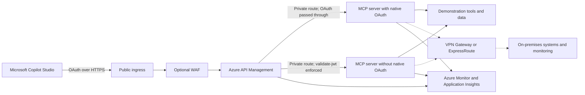
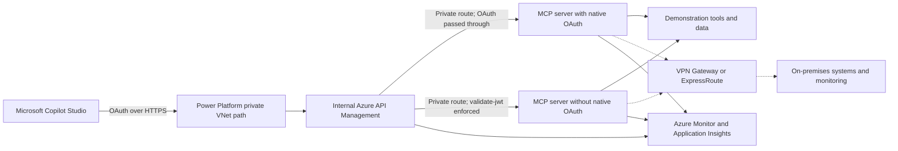

# Product Vision

## Vision

Demonstrate how a Microsoft Copilot Studio agent can securely use tools exposed by Model Context Protocol (MCP) servers hosted on Azure Container Apps in a private subnet. The project will target two architectures: public ingress to Azure API Management (APIM), and private ingress through Power Platform virtual network connectivity. In both architectures, APIM provides the governed API boundary for authentication, authorization, routing, throttling, and policy enforcement while the MCP backends remain private.

Both architectures will demonstrate two OAuth enforcement patterns:

- An MCP server that implements and validates OAuth itself.
- An MCP server without native OAuth support for which APIM enforces OAuth by applying the `validate-jwt` policy before forwarding requests.

## Strategic Goals

- Prove end-to-end MCP tool discovery and invocation from a Copilot Studio agent.
- Keep both MCP servers isolated in a private Azure Container Apps environment.
- Compare public APIM ingress with private ingress through Power Platform virtual network connectivity.
- Use APIM as the single controlled entry point for authentication, authorization, routing, throttling, and policy enforcement.
- Compare native MCP server OAuth enforcement with APIM-enforced OAuth for a backend that does not support OAuth.
- Provide repeatable infrastructure and deployment guidance suitable for demonstrations and further experimentation.
- Make security, network flow, diagnostics, and operational behavior observable and understandable.

## Target Architectures

The project will demonstrate public and private ingress paths to the same governed, privately hosted MCP services.

### Architecture 1: Public Ingress

The target solution consists of:

- A Microsoft Copilot Studio agent and MCP client that invoke MCP capabilities over OAuth-protected HTTPS through the public internet.
- Public ingress to an Azure API Management gateway, optionally protected by a web application firewall (WAF).
- Two MCP servers deployed to Azure Container Apps with private ingress in a private subnet.
- One MCP server that validates OAuth access tokens natively.
- One MCP server without native OAuth support, protected by the APIM `validate-jwt` policy.
- Virtual network integration, private name resolution, and routing that allow APIM to reach both MCP servers while preventing direct public access.
- Microsoft Entra ID and managed identities, where supported, for service authentication and authorization.
- Azure Monitor and Application Insights for request tracing, diagnostics, metrics, and auditability.
- Optional hybrid connectivity through a VPN gateway or Azure ExpressRoute to generic on-premises systems and monitoring services.

Neither MCP server will provide a directly accessible public endpoint. APIM will apply shared governance policies to both routes. For the MCP server with native OAuth, APIM will preserve the access token for backend validation. For the server without native OAuth, APIM will validate the token using `validate-jwt` and forward only approved requests over private networking.

### Architecture 2: Power Platform Private Ingress

The private-ingress variation consists of:

- A Microsoft Copilot Studio agent and MCP client that invoke MCP capabilities over OAuth-protected HTTPS.
- Power Platform virtual network connectivity that provides a private path from Copilot Studio into the Azure virtual network.
- An internal APIM gateway and two MCP servers contained within the Azure private virtual network boundary.
- Two MCP authentication patterns matching the public-ingress architecture: native OAuth validation by one server and APIM `validate-jwt` enforcement for the server without native OAuth.
- Private DNS and routing that keep APIM and both Azure Container Apps backends inaccessible from the public internet.
- Azure Monitor and Application Insights for request tracing, diagnostics, metrics, and auditability.
- Optional hybrid connectivity through a VPN gateway or Azure ExpressRoute to generic on-premises systems and monitoring services.

This variation removes public ingress from the Copilot Studio-to-APIM path. OAuth remains mandatory and complements, rather than replaces, the network isolation provided by Power Platform virtual network connectivity.

## Planned Capabilities

- Deploy the Azure network, private Azure Container Apps environment, APIM gateway configurations, identity resources, optional WAF, and monitoring resources through infrastructure as code.
- Host two MCP servers that expose a small set of safe, deterministic demonstration tools.
- Connect a Copilot Studio agent to the MCP endpoints presented by APIM through both public and Power Platform private ingress.
- Demonstrate native OAuth validation by one MCP server.
- Enforce OAuth for the MCP server without native OAuth by using the APIM `validate-jwt` policy.
- Enforce request validation, authorization, rate limits, and suitable timeouts through APIM policies.
- Preserve MCP request and response behavior through the gateway, including any transport requirements selected by the implementation.
- Configure Power Platform virtual network connectivity, private DNS, and routing for the private-ingress variation.
- Support optional hybrid access to on-premises systems through a VPN gateway or Azure ExpressRoute without coupling the architecture to a specific platform.
- Correlate requests across Copilot Studio, APIM, and the MCP server for troubleshooting and demonstration purposes.
- Document deployment, configuration, validation, and teardown workflows.

## Security Vision

- Permit public ingress only to the governed APIM endpoint, optionally through a WAF.
- Provide no public APIM ingress in the Power Platform private-ingress variation.
- Deny direct public ingress to both MCP servers.
- Require valid OAuth access tokens for both MCP routes, with validation performed by either the backend MCP server or APIM according to the selected pattern.
- Apply least-privilege access to identities, network paths, and Azure resources.
- Store secrets and configuration outside source control, using managed identity and Azure-hosted secret management where practical.
- Terminate and enforce TLS at all applicable boundaries.
- Restrict the exposed MCP surface to explicitly approved tools and operations.
- Avoid logging credentials, tokens, secrets, or sensitive tool payloads.

## Roadmap

1. Define the demonstration scenario, MCP tools, trust boundaries, and acceptance criteria.
2. Establish the Azure network, public APIM ingress, and private Container Apps hosting foundation.
3. Implement and deploy both demonstration MCP servers.
4. Configure APIM private backend connectivity, native OAuth pass-through, `validate-jwt` enforcement, policies, and MCP routing.
5. Configure the Copilot Studio agent and validate end-to-end tool invocation through public ingress.
6. Configure Power Platform virtual network connectivity and validate end-to-end tool invocation through private ingress.
7. Validate optional hybrid connectivity to generic on-premises targets.
8. Add monitoring, operational guidance, security validation, and repeatable deployment documentation.

## Success Criteria

The demonstration will be successful when a Copilot Studio agent can discover and invoke approved tools on both MCP servers through both the public APIM endpoint and the Power Platform private VNet path. APIM must privately reach both backends, neither backend may be invoked directly from the public internet, and the private variation must not expose APIM publicly. Unauthorized requests must be rejected under both OAuth enforcement patterns, and operators must be able to trace requests across each complete path.

## Long-Term Direction

The demonstration should provide a foundation for evaluating production concerns such as multiple MCP servers, environment isolation, reusable APIM policy sets, stronger workload identity integration, private enterprise connectivity, centralized governance, automated compliance checks, resilience, scaling, and cost management.